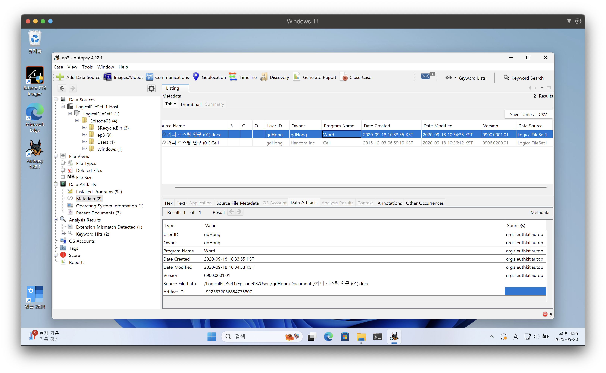
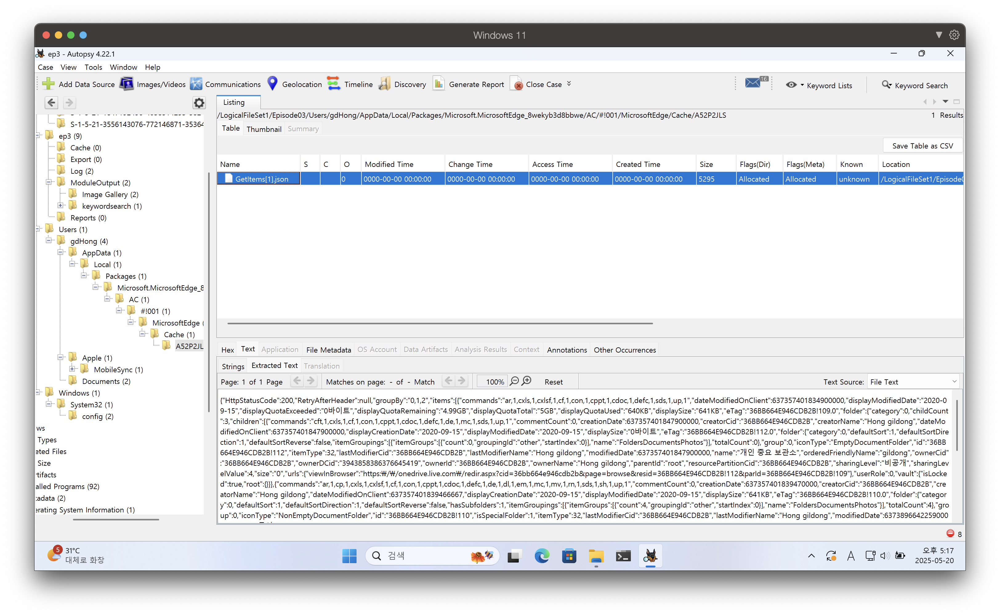
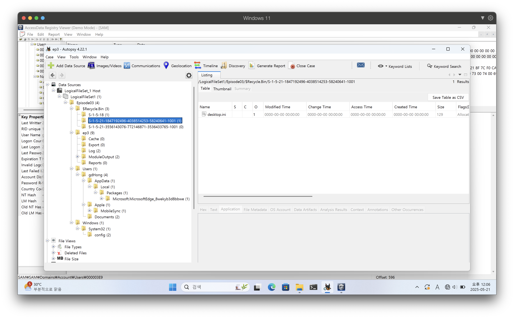
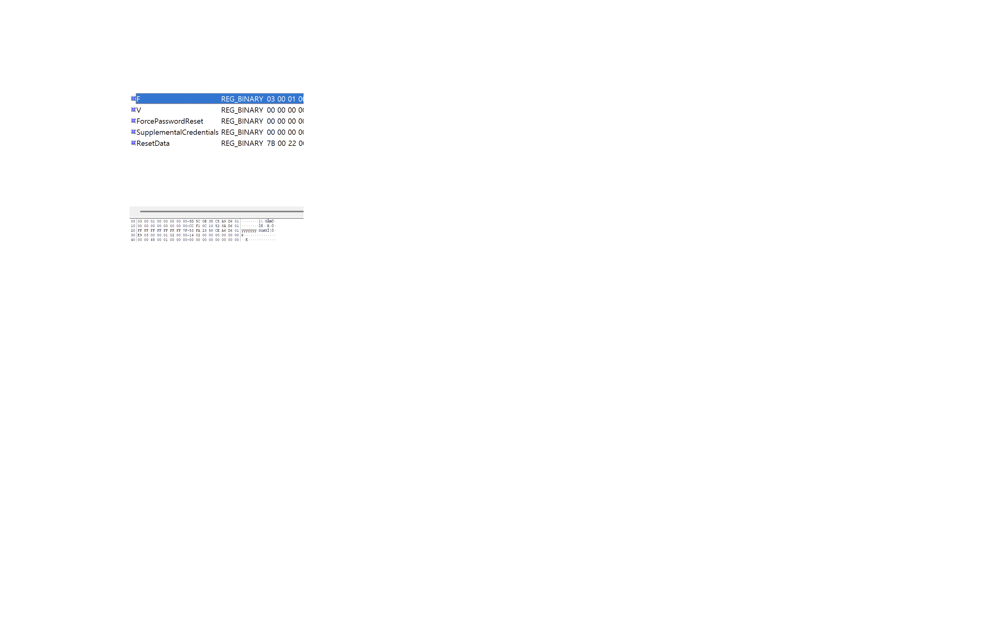
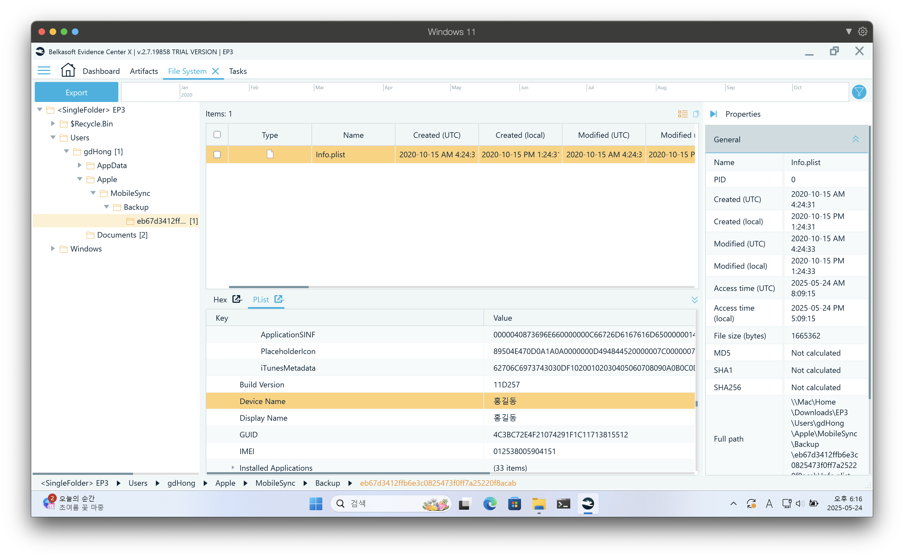
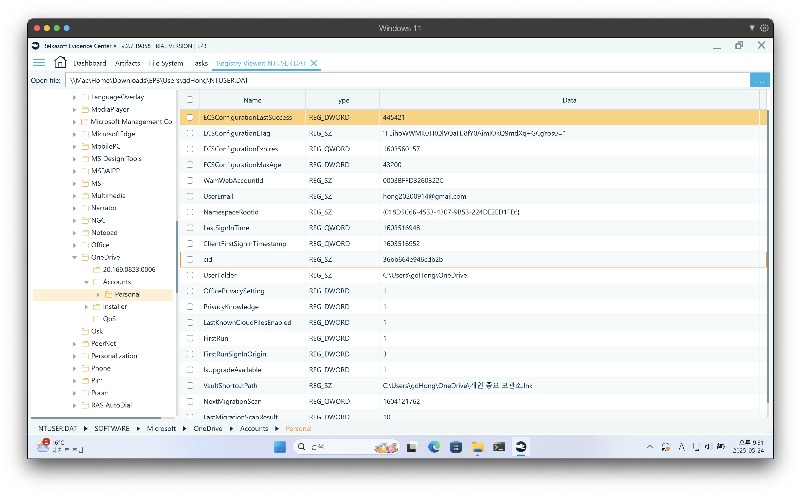

# 컴퓨터의 주된 사용자에 관한 분석

## 컴퓨터 시스템의 범용성과 특징
분석 대상 컴퓨터의 사용자가 한 명일 것이라는 선입견을 품지 말자.

그렇다면 컴퓨터의 주된 사용자는 어떻게 특정할 것인가?

컴퓨터의 인수인계 과정에서 전임자의 계정이름을 그대로 사용할 경우, 컴퓨터의 기록된 계정명과 현재 사용 중인 실제 사용자의 이름이 다를 수 있다.

이메일 주소 메신저 계정명, OneDrive 계정명, 윈도우 이벤트 로그 등의 추가적인 분석을 통해서 빈도가 가장 높은 사용자를 특정할 수 있다.

# 실습

## 문서파일 작성자 확인

## GetItem[1].json 파일에서 OneDrive 계정 사용자 분석

## SAM 파일 분석

### gdHong V값과 SID 비교

| | 의미 |
| - | - |
| S | SID의미|
| 1 | 버전 번호 |
| 5 | SID를 생성할 수 있는 최고수준의 권한등급 |
| 21-1847192496-4038514253-58240641 | 하위권한 |
| 1001 | 비교식별값 RID, 특정사용자 또는 그룹 식별 |

### F값에서 마지막 로그온 한 일시 확인

| 속성 | 값 | 변환 결과 |
| - | - | - |
| 마지막 로그온 시각 | Ox01D6A9C5350B5C5D | 2020.10.24. 05:19 (UTC) → 2020.10.24. 14:19 (KST) |
| 마지막 패스워드 변경 시각 | Ox01D68A52100CF1CC | 2020.09.14. 04:46 (UTC) → 2020.09.14. 13:46 (KST) |
| 마지막 실패 로그온 시각 | Ox01D6A6CE5823FA53 | 2020.10.20. 10:47 (UTC) → 2020.10.20. 19:47 (KST) |
| 로그온 횟수 | Ox45 | 69회 |

## 주된 사용자 특정하기

### plist

### OneDrive

