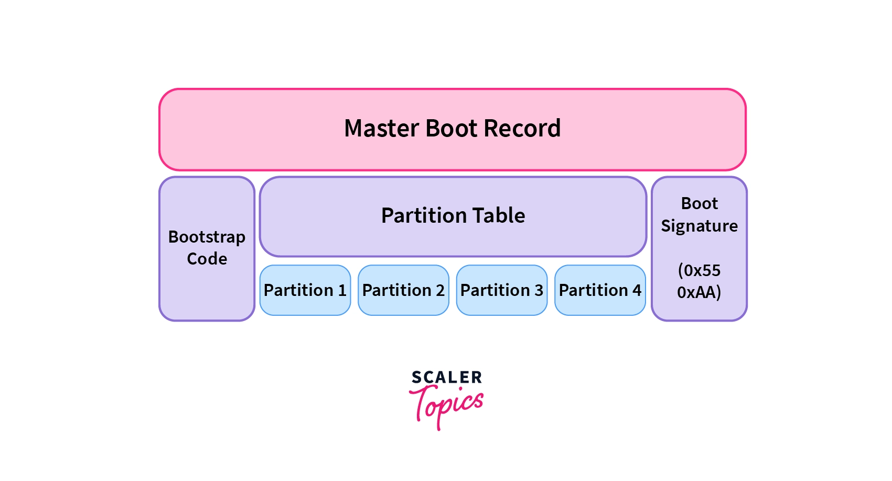
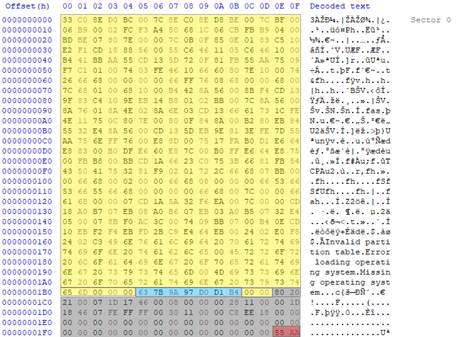
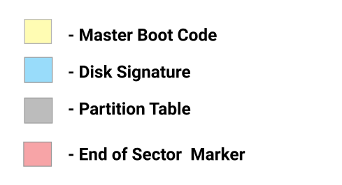
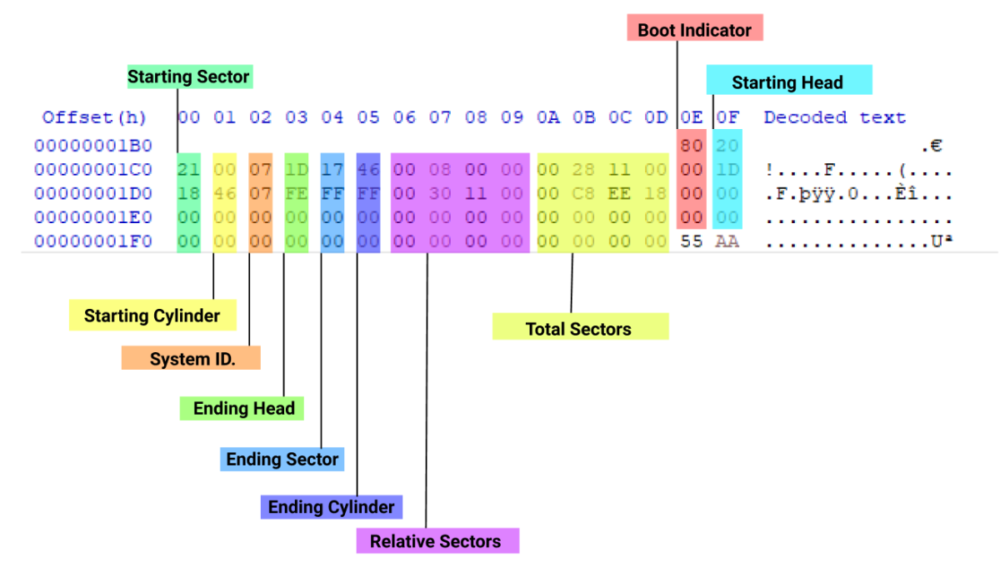
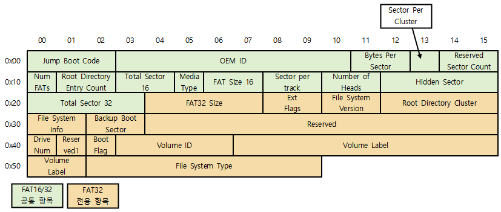
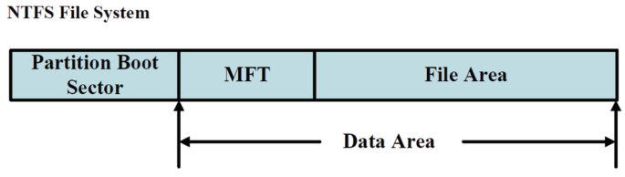
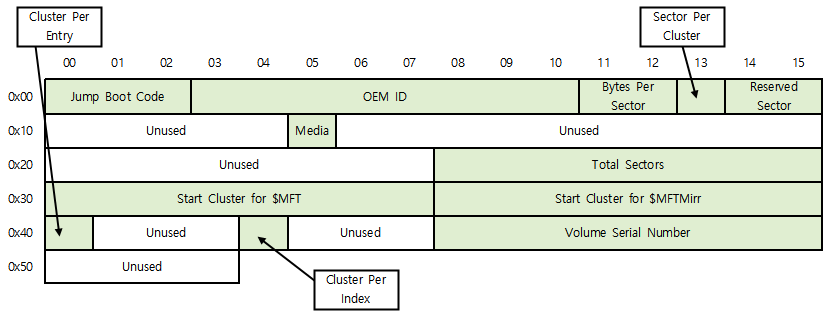

# 파일시스템
데이터를 보관 또는 조직하는 체제

# 퍼티션(Partition)
하나의 디스크 혹은 USB장치에 저장공간을 독립된 영역으로 나누어 사용할 수 있도록 정의한 규약

하나의 ssd로 2개 이상의 드라이브 사용가능

# MBR(Master Boot Record)
## MBR의 역할
윈도우의 실행을 위해 `윈도우가 설치된 파티션의 위치를 확인하여 알려줌`
## MBR의 특징
- 첫번째 섹터에 위치하여 부트코드와 파티션 테이블 영역으로 나눠지며, 각 파티션의 BR의 위치를 정의한다. 즉 MBR이 손상되게 된다면, OS는 파티션을 찾을수 없음
- 단일 파티션의 경우 부트레코드는 1개이며, MBR영역이 존재하지 않을수도 있음.
- Hex Editor의 디스크 열기를 이용하여 열어보면 첫 번째 섹터인 0번 섹터에 0~511byte까지가
MBR이며 이중 `446byte부터 16byte씩 각 파티션 영역`

- 파티션테이블은 총 4개의 파티션을 기록할 수 있으며 파티션 1개의 정보는 16Byte로 표현

1,3,1,3,4,4

- power on -> BIOS -> HDD,SSD -> MBR -> 21sector -> BR -> 21sector

- Boot Indicator, Boot signature
    - 00: 부팅사용X
    - 80: 활성 파티션
- System ID, System signature

| Partition Type | ID Value |
| - | - |
| 0x07 | NTFS partition or logical drive |
| 0x0B | FAT32 partition or logical drive |
| 0x0C | FAT32 partition or logical drive |
| 0x42 | Dynamic disk volume |
| 0xEE | GPT Partition |

- Starting LBA Addr, Relative Sectors(파티션 시작섹터)

# BR(Boot Record)
- 주로 설치 OS 부팅하는 역할, 시스템마다 사용하는 방법이 다르게 정해져있음
- 각 파티션의 첫번째 섹터에 위치
## FAT BR의 구조

### Boot Record, Boot sector
- 볼륨의 첫 번째 섹터, 예약된(Reserved) 영역의 첫 번째 섹터
- 만약 볼륨 내용이 완벽히 살아있어도 `부트레코드 섹터의 데이터가 지워지면 윈도우에서는 해당 볼륨을 인식 할 수 없다.`

- Byte Per Sector: 섹터당 용량. 보통 512B
- Sector Per Cluster: 클러스터당 섹터 개수
- Total Sector 32: 이 파티션의 총 섹터 수
- Volume ID: 시리얼 넘버

## NTFS BR 구조

### Boot Record, Boot sector
- NTFS의 부트 레코드 구조는 `FAT 파일시스템의 부트 레코드와 구조가 비슷`하며, 이 영역에는 Windows를 부팅을 위한 기계어 코드와 NTFS 여러 설정 값들이 있다.
- 이 영역을 분석함으로써 `볼륨의 크기, 클러스터의 크기, MFT의 시작 주소의 정보`를 얻을 수 있다.
- 1개의 섹터 뿐이지만, 여러 섹터가 부트 레코드 용으로 예약되어 있으며, 운영체제가 NTFS를 인식하기 위한 시작점이 되기 때문에 `이 영역이 망가지면 인식이 불가능` 하다.
### MFT(Master File Table)
- 정형화된 레이아웃이 없는 대신 MFT가 존재하며, MFT에는 `존재하는 모든 파일과 디렉토리의 정보를 담고 있는 테이블`이다.
- 테이블을 분석하게 되면 볼륨에 있는 파일과 디렉토리에 대한 정보를 알아낼 수 있으며, Windows 가 볼륨을 인식할 때 가장 먼저 접근하는 영역이 부트레코드이긴 하지만, 부트 레코드는 MFT가 어디 있는지 알아내어 그 곳을 조사하는 것이 주 목적이다.
- MFT도 데이터 영역에 존재하는 파일로 관리되므로 `볼륨의 어디에 위치하든 상관 없게 된다.`

- Total Sector 32: 이 파티션의 총 섹터 수
- Volume Serial Number: 볼륨 아이디
