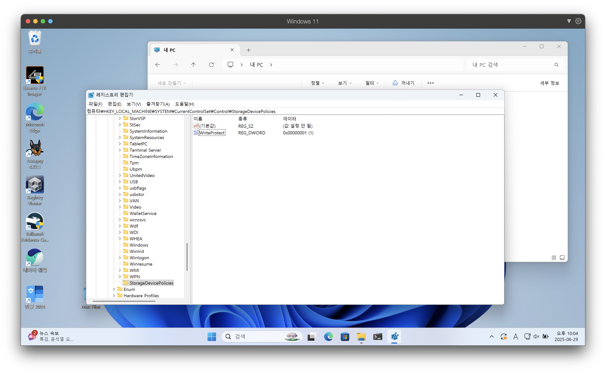
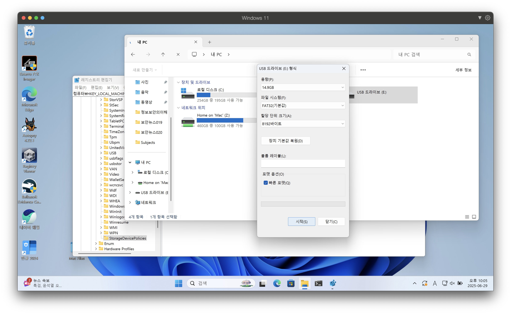
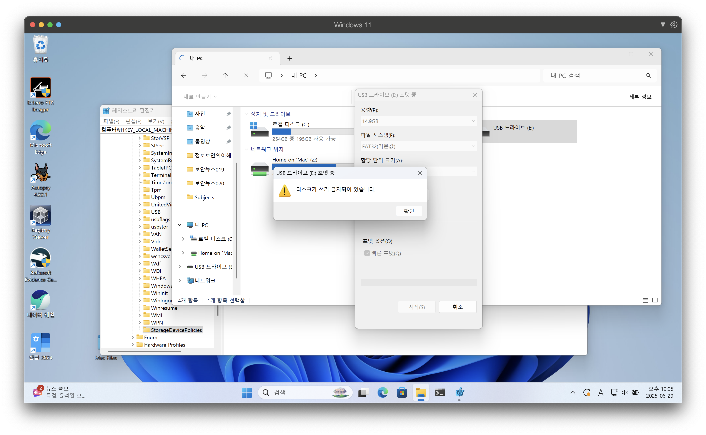
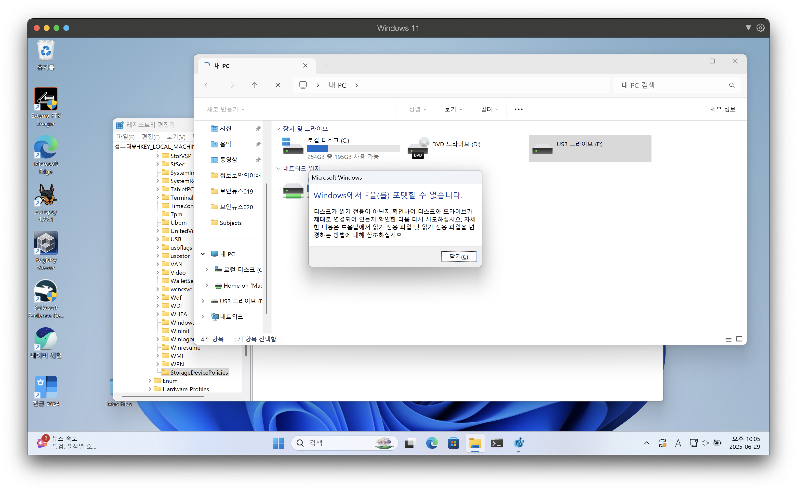

# 레지스트리 수정을 통한 쓰기 방지

`HKEY_LOCAL_MACHINE\SYSTEM\CurrentControlSet\Control`

`StorageDevicePolicies`가 없는 경우 키 새로 생성

새로 만들기 -> DWORD(32비트) 값(D) -> `WriteProtect`

# EnCase FAstBloc SE를 이용한 쓰기방지
Tools -> FastBloc SE

Write Protected 모드 선택
