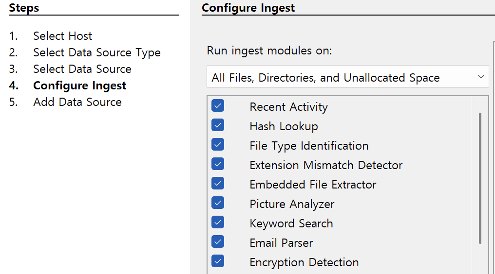
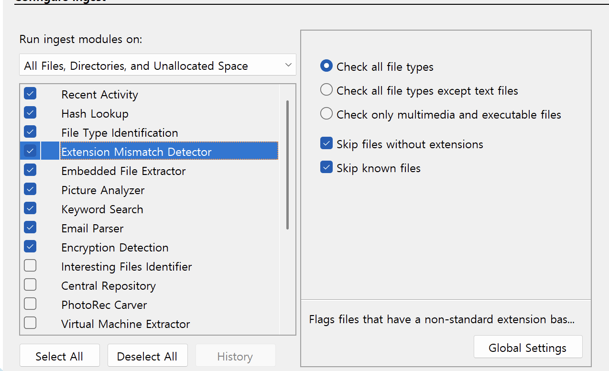
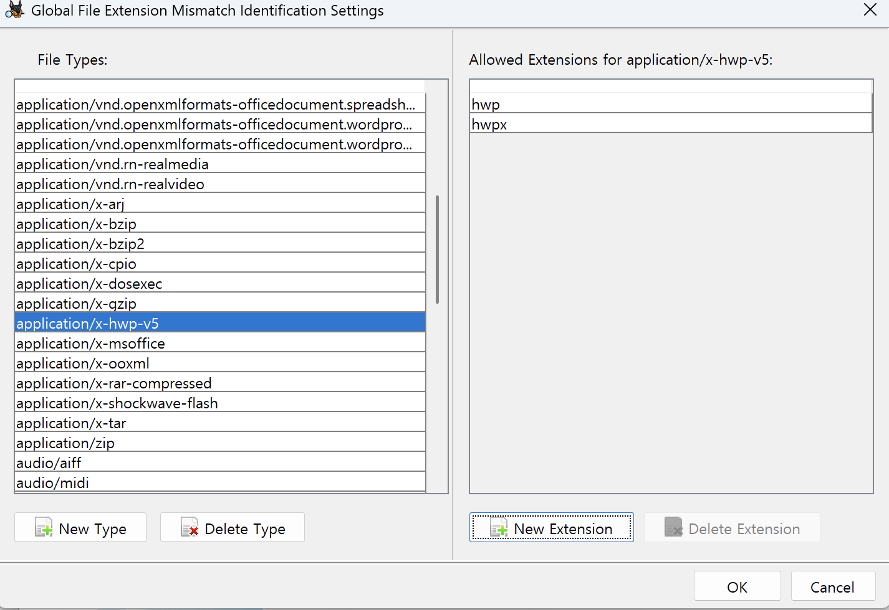
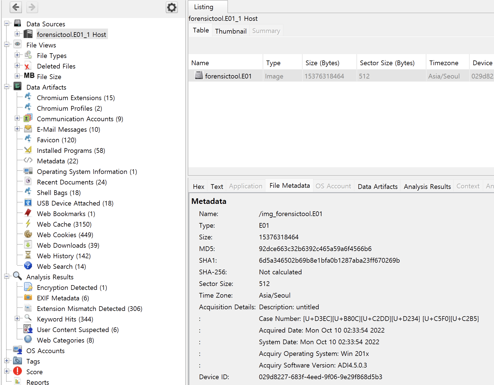
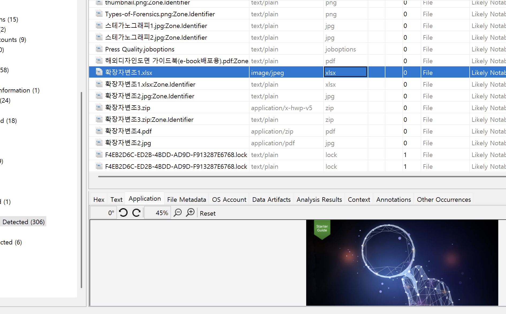
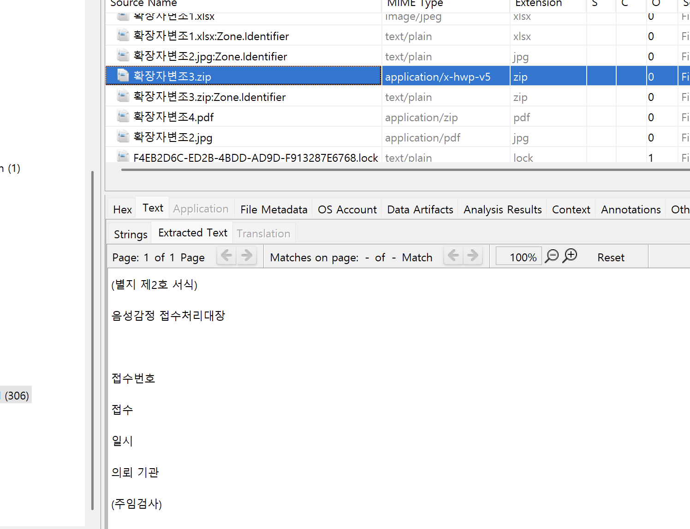
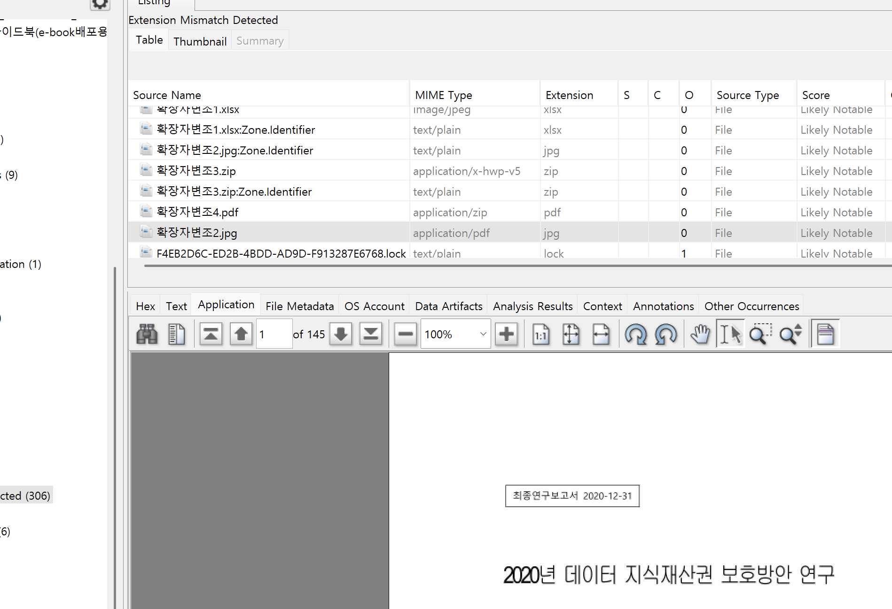
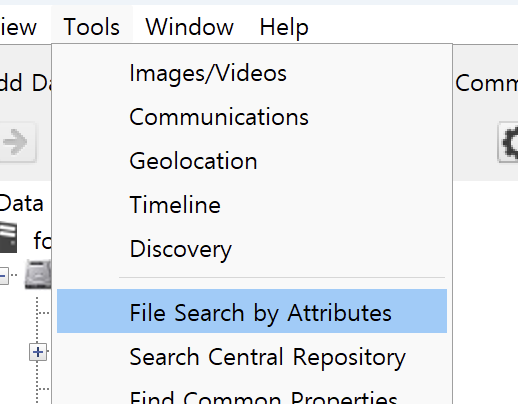
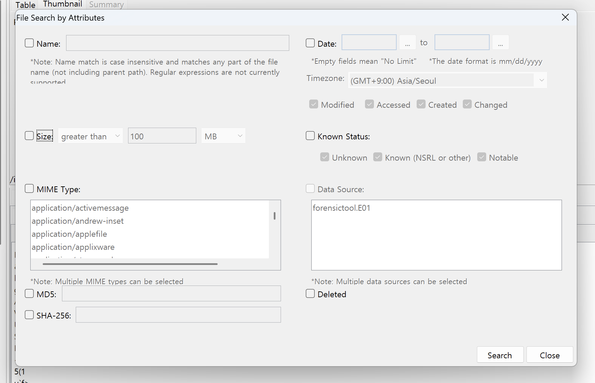

## 함꼐 사용할 프로그램
https://dfrc.korea.ac.kr/infra_dfrc_tools
- REGA
    - 윈도우 레지스트리 수집 및 분석 도구
- LNK Parser
    - 링크파일 분석 도구

## 분석 옵션 설정

- Recent Activity : 운영체제, 설치된 프로그램, 웹브라우저 등의 사용자 행위 분석 모듈
- Hash Lookup : 해시값 산출 모듈
- File Type Identification : 시그니처 분석을 통한 파일 확장자와 관계 파악 모듈
- Embedded File Extractor : 압축파일(zip 등)과 MS-Office 파일, 한글(.hwp)파일 등의 내부 구조 분석 모듈
- Picture Analyzer : 사진 파일에 담긴 EXIF 정보 분석 모듈
- Email Parser : MBOX, EML, PST 등의 이메일 파일 분석 모듈
- Encryption Detection : 암호화 파일 분석 모듈

`Extension Mismatch Detector` 부분에서 `Check only multimedia and executable files`로 체크되어있는 경우 `Check all file types`로 바꾸어준다.

그 후 Global Setting에 들어가서 아래와 같이 만들어 준다.

분석을 시작하면 분석하는 동안 법이론이나 풀 수 있는 문제들을 먼저 푼다.

## 분석

증거매체에 대한 이미지 정보들을 볼 수 있다.

### 확장자 변조
Analysis Results -> Extension Mismatch Detected 에서 볼 수 있다.
- MIME Type: 시그니처 분석을 통해 알아낸 실제 파일의 유형

몇가지 의심되는 파일들을 발견할 수 있다.

탐색 순서
- 파일명, 확장자 확인
- MIME Type 확인
- 시그니처 확인
- 추출 후 의심되는 확장자로 변경

### 파일검색

Tools -> File Search by Attributes

이름, 크기, 확장자, 해쉬값, 날짜(MAC)로 검색할 수 있다.