# [Unrecognized file system] Error
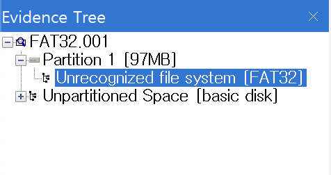

파티션이 손상된걸 확인

# hex editor
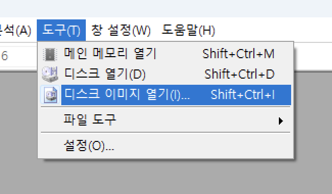
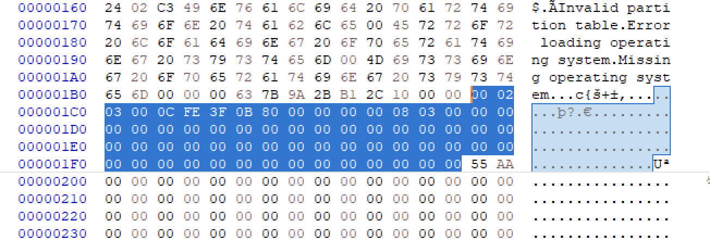
섹터0를 보니 4개의 파티션 테이블 중에 하나만 데이터가 존재함.

| 00 | 02 03 00 | 0C | FE 3F 0B | 80 00 00 00 | 00 08 03 00 |

0C = FAT32 partition or logical drive

80 00 00 00 = 파티션 시작 섹터(부트 레코드 자리)

00 08 03 00 = 이 파티션의 전체 섹터의 수

리틀 엔디안 -> 00 00 00 80 -> 128

## sector 128
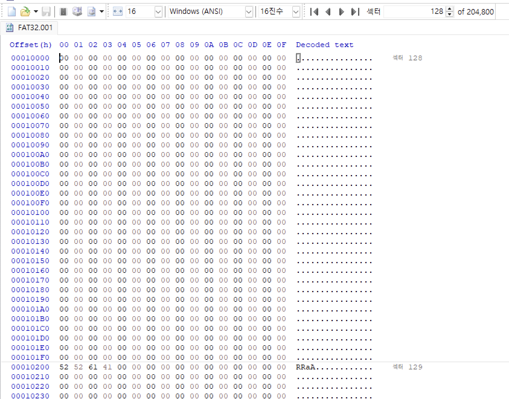
가보니 아무것도 없다

FAT32의 다음 섹터에 RRaA가 옴

FAT32 섹터 +6 을 하여 백업본은 찾음
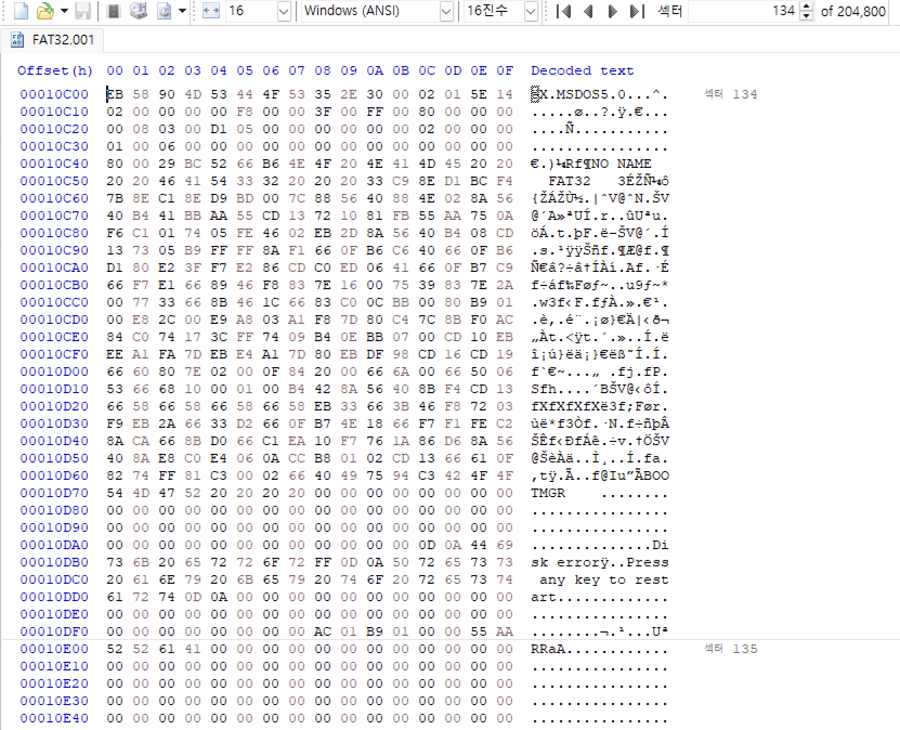
백업본이 존재함 -> 128번 섹터가 손상되었다는 증거

## 복구
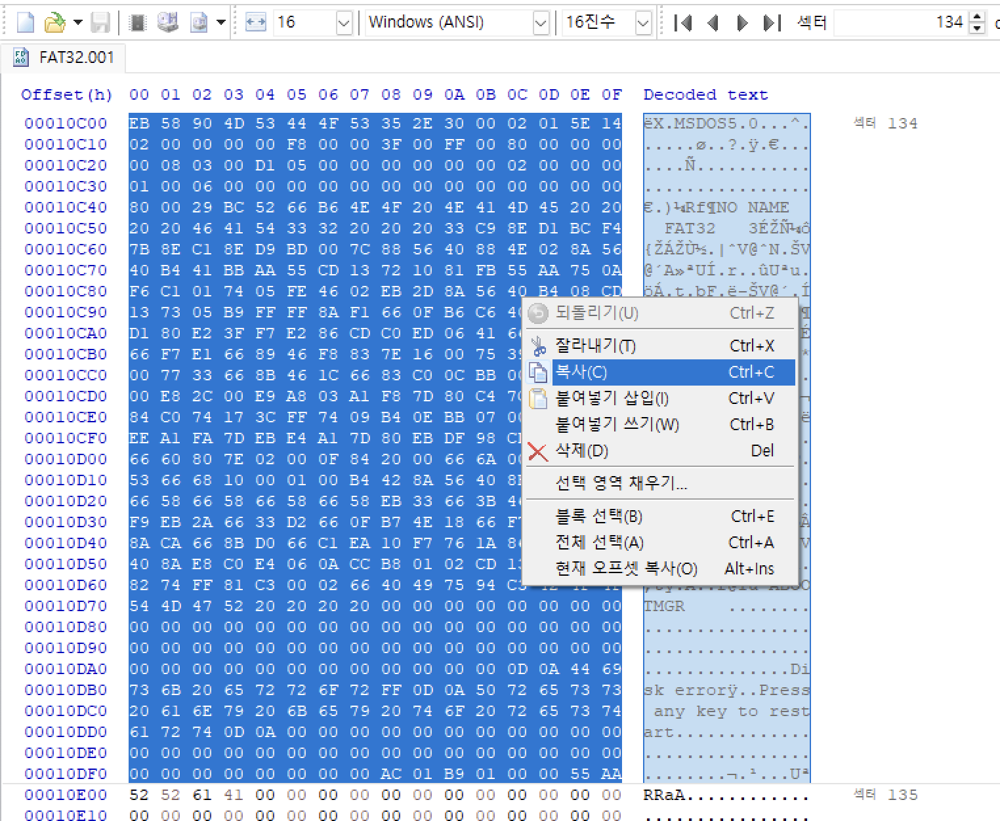
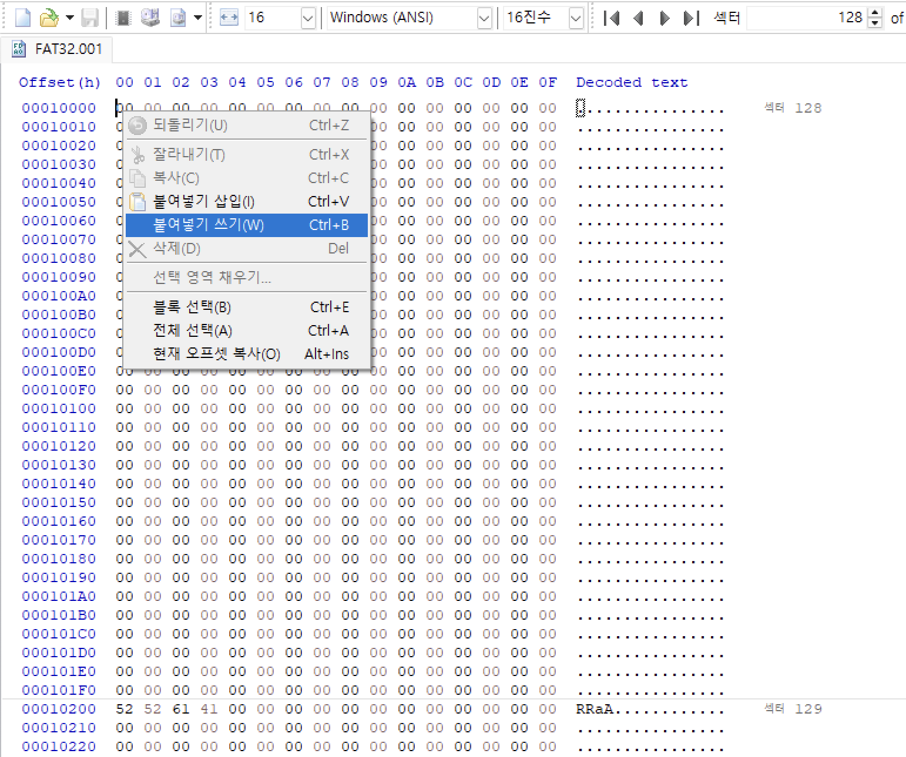
삽입을 하게 되면 밀려나기 때문에 주의해야 한다.
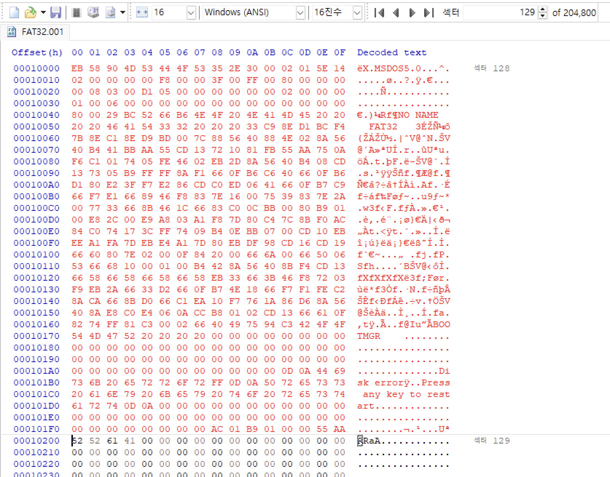

## FAT32 복구 완료
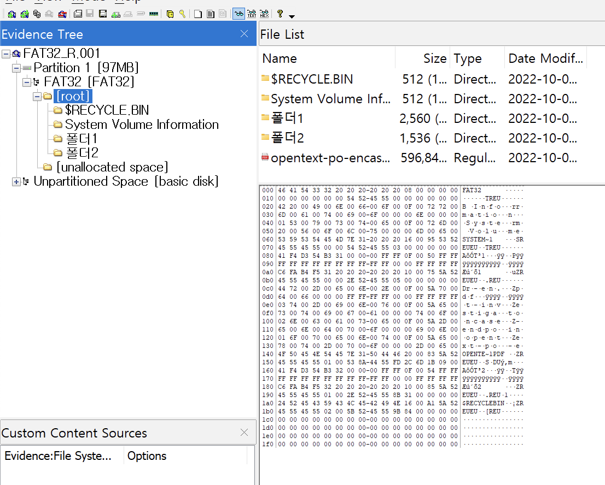

성공적으로 복구된 모슴.

# NTFS 복구

NTFS의 부트 레코드 다음 섹터에는 이러한 내용이 나온다.
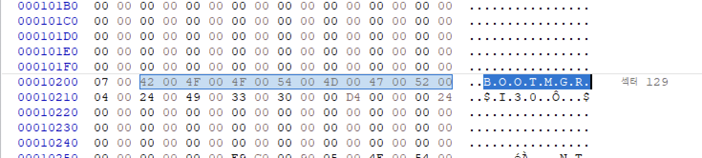

NTFS의 백업본은 파티션의 마지막에 위치하게 된다.

MBR에서 확인해본 결과
00 08 03 00 -> 00 03 08 00 -> 198656

198656+128(시작)-1(인덱스) = 198783

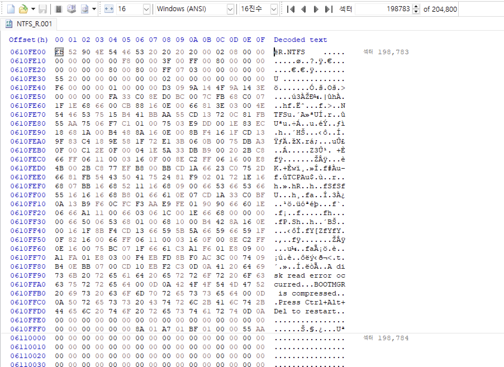
실제로 백업본이 존재한다는 것을 알 수 있다.

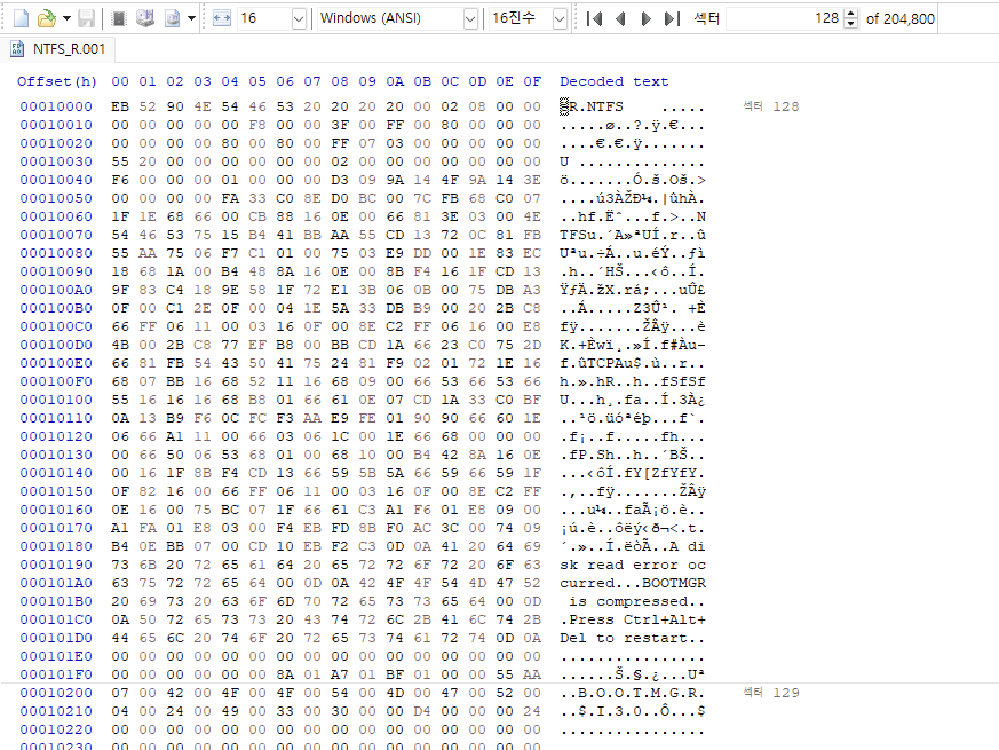

## NTFS 복구 완료
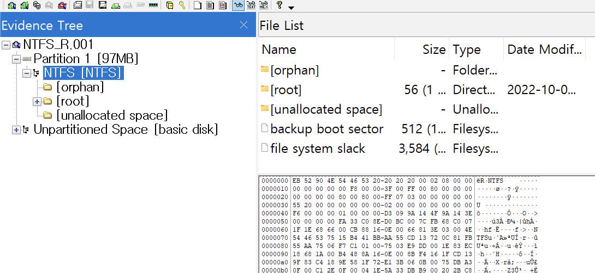
복구된 내용을 확인할 수 있다.