# Hash값 확인

# 증거물 매체의 정보 확인
- USB: 총 용량, 총 섹터수, 시리얼 넘버, hash값 등
- 파티션/볼륨: 파일시스템 종류, 용량, 섹터수, 시리얼넘버, 클러스터 크기, 섹터당 용량 등
- FTK Imager, 이미지 생성로그, Autopsy 교차확인 (하면 좋음)

# USB 소유자 확인
- 공인인증서
- 개인적인 문서

# 특정파일의 헤더 시그니처 복구
파일의 헤더 시그니처를 고의로 훼손

## 2가지 훼손 유형
### 헤더의 Hex값을 임의변경
복구방법 -> 동일한 확장자를 가진 정상적인 파일의 시그니처 헤더와 비교하여 틀린 부분을 HxD로 수정 후 저장

주요 시그니처

| zip,docx,pptx,xlsx | 50 4B 03 04 (PK  ) | ZIP,MS관련 |
| - | - | - |
| HWP | DO CF 11 EO A1 B1 1A E1 () | 한컴 한글 문서 |
| PDF | 25 50 44 46 (%PDF) | PDF문서 |
| Alz | 41 4C 5A 01 (ALZ) | 알집 압축파일 |
| JPG | FF D8 FF EO XX XX 4A 46 49 46 (JFIF) | JPEG 이미지 |
| JPG | FF D8 FF E1 xx XX 45 78 69 66 (Exif) | JPEG 이미지(EXIF 정보 포함) |
| GIF | 47 49 46 38 39 61 (GIF89a) | GIF 이미지 |
| PNG | 89 50 4E 47 0D OA 1A OA (%oPNG ) | PNG 이미지 |

# 스테가노그라피(Steganography)

## 확인 방법

| | SOI | EOI |
| - | - | - |
| JPG | FFD8 | FFD9 |
| PNG | 8950 | 6082 |
| GIF | 4749 | 003B |

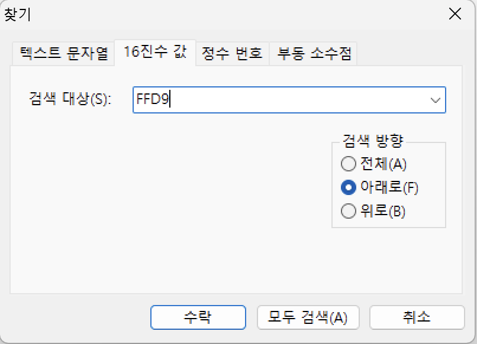
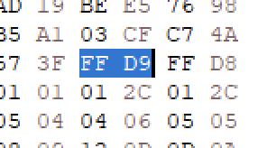
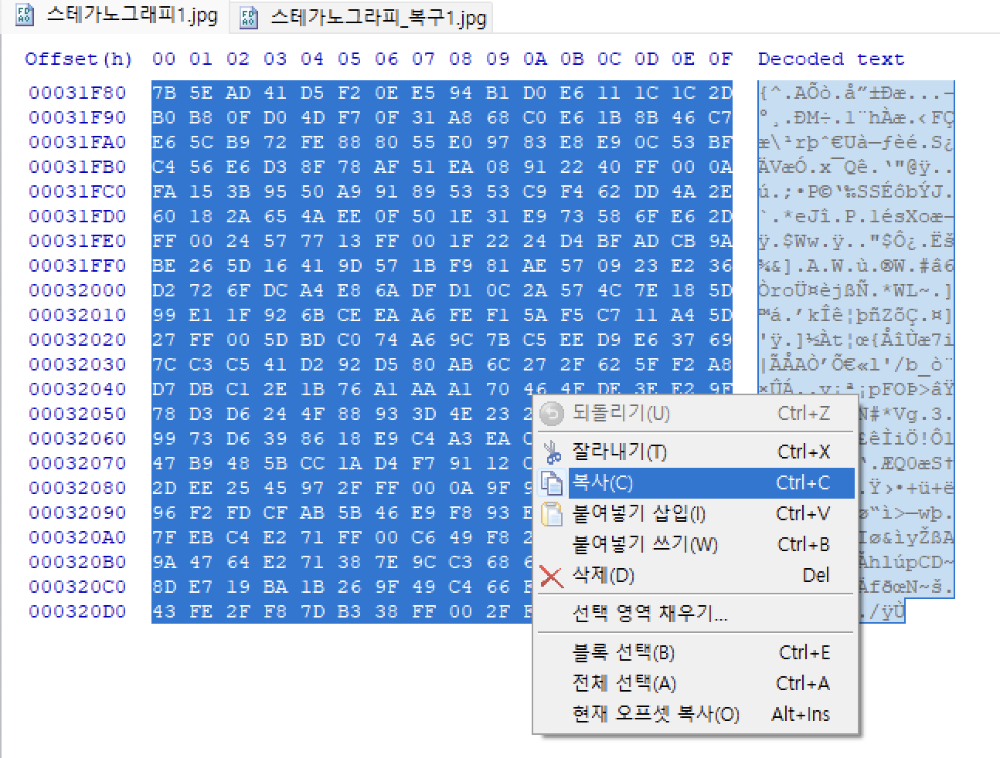

이렇게 EOI 뒤에 SOI가 jpeg인 파일을 찿을 수 있다.

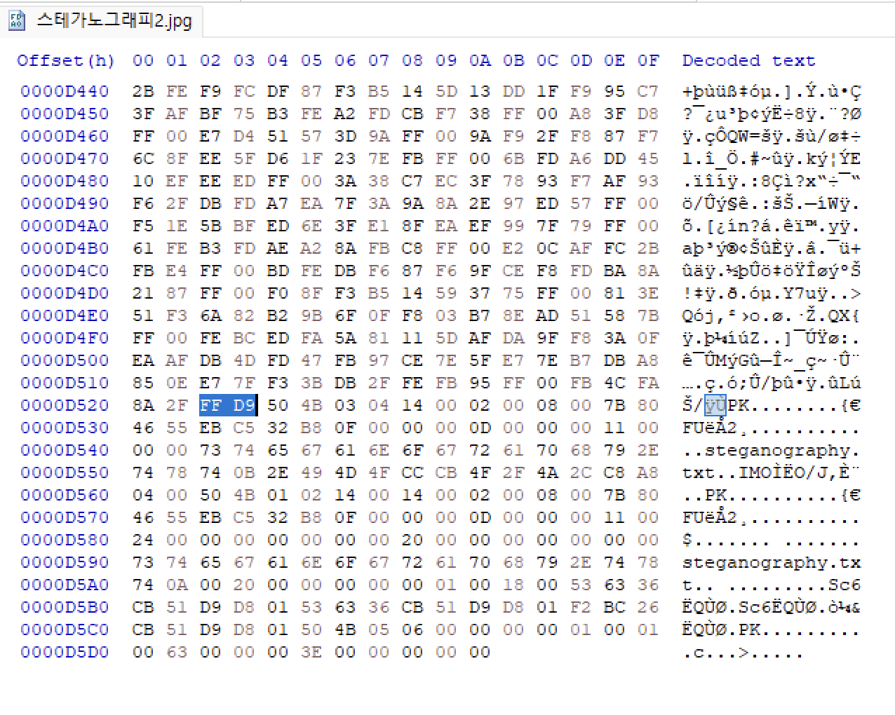

EOI를 이용하여 뒤가 ZIP파일 인 경우도 찾을 수 있다.

# USB연결 흔적 확인

## SetupAPILogging
- 위치: Windows\inf\Setupapi.dev.log
- 정보: USB 볼륨명, 시리얼넘버, 볼륨GUID, Product ID, 최초 연결 시간, 마지막 연결 해제 시간, 저장매체를 사용한 사용자 계정 정보 등
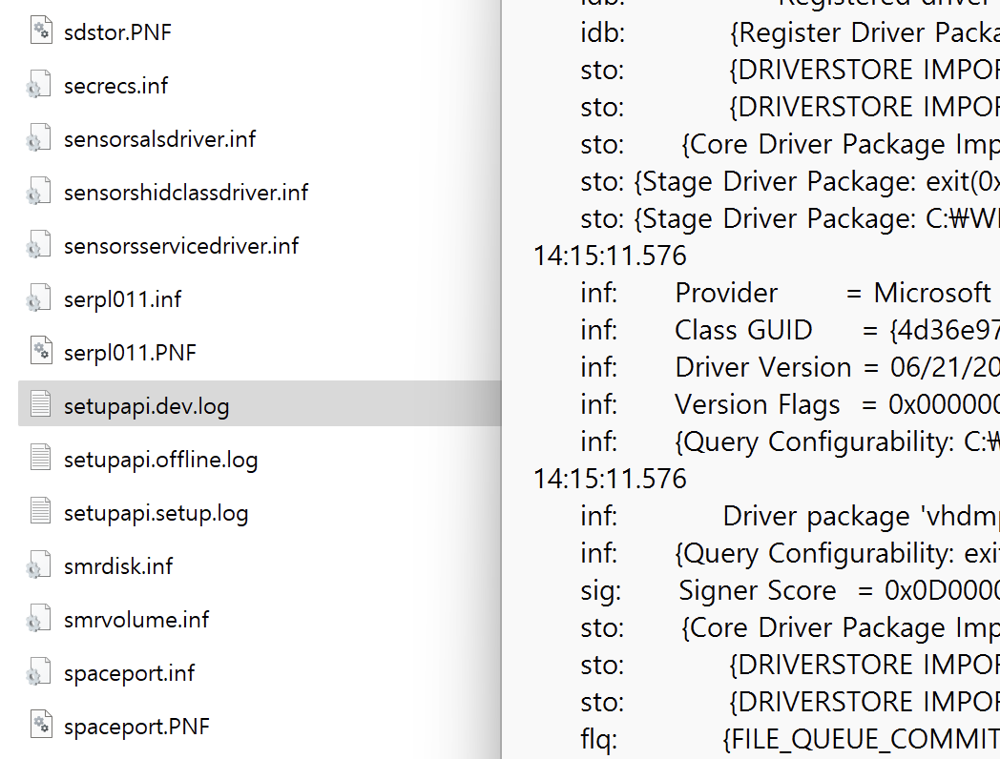

## Registry | USBSTOR
- 위치: `HKEY_LOCAL_MACHINE\SYSTEM\ControlSet001\Enum\USBSTOR`
- 정보: USBSOTR의 Subkey를 분석할 경우 이미 해당 시스템에서 사용하거나 사용했던 USB 장치를 확인
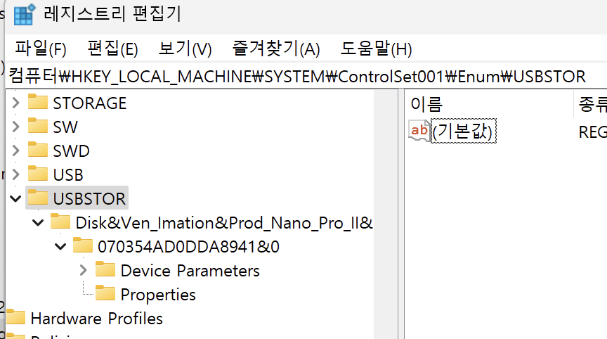
- 형식: Disk&Ven_XXX&Prod_XXX&Rev_XXX
    - Ven_XXX: 제조사명
    - Prod_XXX: 제품명
    - Rev_XXX: 버전
- Unique Instance ID
## Registry | USB
- 위치: `HKEY_LOCAL_MACHINE\SYSTEM\ControlSet001\Enum\USB`
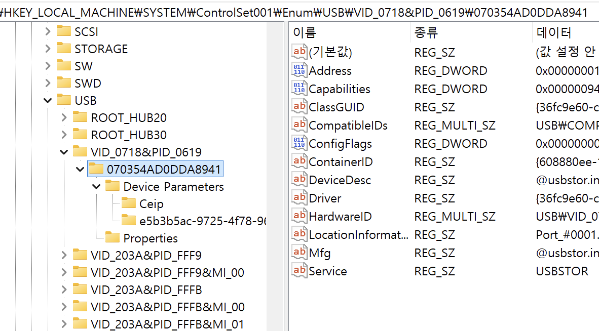
- 정보: USBSOTR에서 확인한 USB의 `Unique Instance` ID를 찾으면 `USB 제조사 아이디(VID)와 제품ID(PID)확인 가능`
## Registry | Windows Portable Devices(필수는 아님)
- 위치: `HKEY_LOCAL_MACHINE\SOFTWARE\Microsoft\Windows Portable Devices`
- 확인 가능한 정보: 연결했던 USB의 볼륨 이름

# EXIF 정보 확인
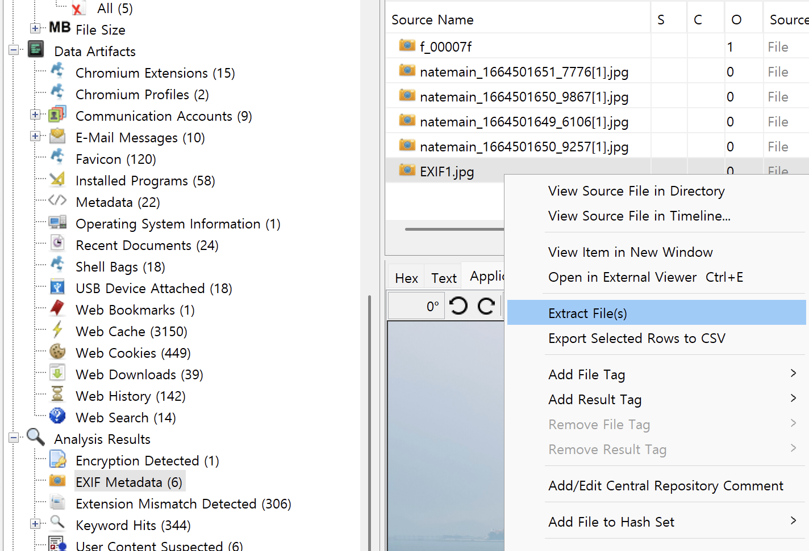
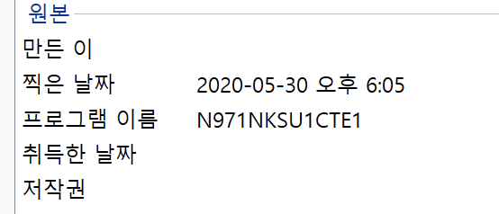
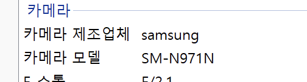
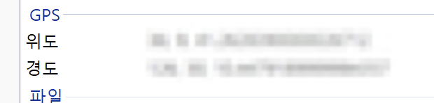

# FTP 사용 흔적
- FTP(File Transfer Protocol)
- FTP Log: 모든 프로그램이 그렇듯이 FTP 프로그램도 자동적으로 로그가 남게 되며, 특`정파일(기밀유출,불법공유 등)에 대해서 유출 또는 공유 흔적`을 찾으라는 문제의 경우, FTP 공유흔적이 답일 가능성도 있기 때문에 FTP프로그램의 로그 분석이 필요
- Filezilla: `전세계적으로 많이 사용하는 FTP 프로그램`으로, FTP 관련 문제가 나온다면 'Filezilla 관련 파일이 남아있을 가능성이 높으며, 분석 중 `'Filezilla라는 이름이 들어간 폴더 또는 파일이 발견된다면 반드시 로그를 확인할 필요가 있음`
* Filezilla 로그파일 : `filezilla.log (이름이 변경되어있을 가능성 존재)`

# Email 정보 확인
## 웹메일
- 모든 내용은 메일서버(네이버, Gmail 등)에 저장
- 다만, 웹메일 송, 수신 화면을 캡처한 이미지 파일이나 내용을 복사, 저장한 텍스트 파일 존재 가능
- Gmail의 경우 .Mbox 라는 백업파일로 저장가능.
## 이메일 클라이언트 프로그램 (Outlook 등)
- 관련 파일 확장자 : 주로 Outlook 프로그램 파일로 Eml, Msg, Pst, Ost 등이 존재

# Print 정보 확인
## Spool
윈도우즈에서 인쇄 명령시 출력물에 대한 데이터가 프린터로 전송되어 출력이 되게 되는데 프린터에 내장된 버퍼의 크기가 작기때문에, 적체현상을 예방하기 위해서 `PC에 출력물에 대한 정보를 담은 임시파일이 생성`되는데 이 과정을 스풀이라고, 이때 생성된 임시 파일을 스풀 파일이라고 함
- RAW 방식 : 프린트 하려는 데이터를 원시(RAW)데이터로 전달
- EMF 방식 : 프린트 하려는 데이터를 EMF(Microsoft Enhanced Metafile) 형식으로 변환하여 전달
- Spool 방식은 개별 프린터의 설정에 따라 달라지며, 일반적으로 `RAW방식을 많이 사용`
## Spool 파일
- 인쇄 작업을 하게 되면 자동으로 인쇄 데이터를 디스크에 파일형태로 임시저장하게되며 인쇄가 정상적으로 완료되면 임시 파일을 자동으로 삭제됨
- 스풀 방식과 상관없이 1개의 인쇄 명령마다 `.Shd 파일과 .Spl 파일이 각각 1개씩 자동 생성`
- .Shd : 소유자, 문서명, 프린터명, 컴퓨터명, 파일 크기 등의 정보 저장
- .Spl
    - RAW방식 : 프린트한 원시 데이터
    - EMF방식 : 파일명, 포트정보(네트워크 프린터의 경우 IP정보) 등의 부가정보 등
- 스풀파일 저장 경로(기본값): `%System root%system32\spoolWPRINTERS\`

