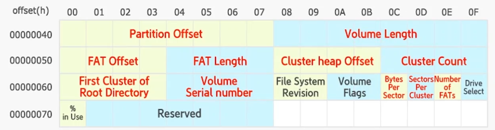

# exFAT

## Volume Boot Record
- 12개의 sector
- 0: boot
- 1~8: 추가적인 boot
- 9: OEM, 제조사에 의해 기록된 내용
- 10: 예약된 영역
- 11: 체크섬

## Boot Sector

- Partition Offset: 파티션 시작위치 섹터값
- Volume Length: 볼륨의 총 섹터 수
- FAT Offset: FAT이 시작하는 섹터 위치(시작섹터로부터 상대값)
- Cluster Heap Offset: 데이터영역이 시작하는 섹터위치(이거도 상대값)
- First Cluster of Root Directory: Root Directory 가 시작하는 클러스터 번호

복구는 +12 확인