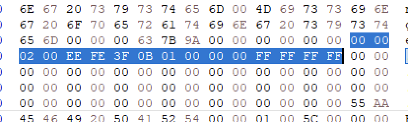
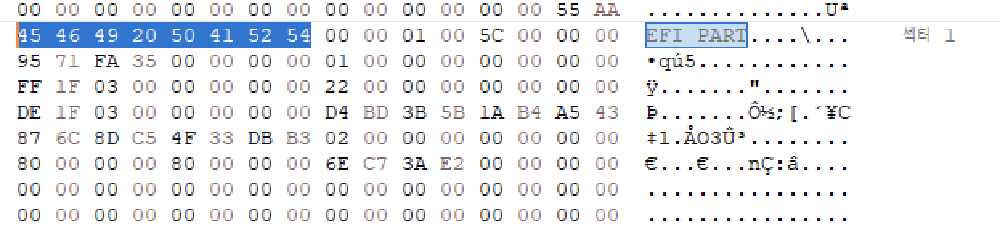
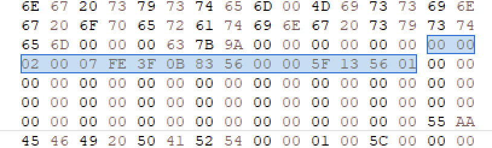
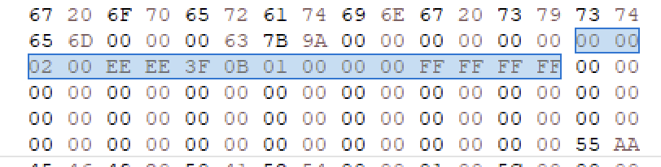

# BIOS & MBR 파티션
## BIOS(Basic Input & Output System)
- 펌웨어 인터페이스
- 요즘은 UEFI로 바뀜 하지만 바이오스라고 많이 불림
## Firmware
- rom에 포함된 소프트웨어, 영구적 소프트웨어

## MBR Partition
- BIOS 시스템에서는 MBR Partition을 사용
- MBR 파티션은 주파티션을 최대 4개까지, 32비트로 최대용량은 2.2T이상 설정 불가

## UEFI(Unified Extensible Firmware Interface)
- GUI메뉴
- 2.2TB 이상의 하드디스크 지원

## GPT Partition
- UEFI 시스템에서 사용

| | 주 파티션의 수 | 하나의 디스크 최대용량 |
| - | - | - |
| MBR | 4 | 2.2TB |
| GPT | 128 | 18EB |

## 구조
GPT Partition

| `MBR` | `GPT Header` | `Partition Table` | partition 1 | partition 2 | ... | partition n | (backup)`Partition Table` | (backup)`GPT Header` |
| - | - | - | - | - | - | - | - | - |

기존의 MBR이 훼손이 되었다면 직접수정하는 방식인데, GPT는 MBR에 대한 백업이 존재.

- EE 는 GPT 파티션
- 시작섹터가 1
- 실제 섹터수와 상관없이 FF FF FF FF 고정

### GPT Header

| Offset | Bytes 00 ~ 07 | Bytes 08 ~ 0F |
| :--- | :--- | :--- |
| **`0x200`** | `Signature "EFI PART"` | `[08-0B]` Revision   `[0C-0F]` Header Size |
| **`0x210`** | `[00-03]` Header Checksum   `[04-07]` Reserved | `LBA of GPT Header` |
| **`0x220`** | `LBA of Backup GPT Header` | Starting LBA for Partitions |
| **`0x230`** | Ending LBA for Partitions | GUID for Entire Disk |
| **`0x240`** | GUID for Entire Disk (이어짐) | `Starting LBA of Partition Table` |
| **`0x250`** | `[00-03]` Number of Partition Entries   `[04-07]` Size of each entry | `[08-0B]` Partition Table Checksum |

### Partition Table
| Offset | Bytes 00 ~ 07 | Bytes 08 ~ 0F |
| :--- | :--- | :--- |
| **`0x400`** | Partition Type GUID (16 Bytes) | |
| **`0x410`** | Partition GUID (16 Bytes) | |
| **`0x420`** | Partition Starting LBA | Partition ending LBA |
| **`0x430`** | Partition Attributes | Partition Name |
| **`0x440`** | Partition Name (이어짐, 총 72 Bytes) | |

## 복구
### MBR 훼손
- EE확인
- 01 00 00 00 섹터번호
- FF FF FF FF 섹터사이즈

이미지에선는 07, 83 56 00 00, 5F 13 56 01 으로 되어있는 것을 정상적인 값으로 바꿔준다.

### GPT Header를 훼손한 경우
- 백업은 마지막섹터에 위치
- 덮어 쓴 후, LBA of GPT Header 값과 백업 LBA of GPT Header 값을 서로 바꿔서 수정
- Starting LBA of Partition Table의 값도 2로 변경

### GPT Partition Table(Entry)를 훼손한 경우
- 볼륨의 마지막 섹터 - 32 에 백업이 있음
- 백업을 찾은 후 필요한 엔트리의 값을 복사 후 덮어쓰기(전체,특정)

### BR을 훼손한 경우
- MBR에서 하는 것과 동일
- 훼손된 파티션의 파일시스템에 따라 BR의 백업섹터를 찾은 후 복사 덮어쓰기
- FAT32: +6, exFAT: + 12 등등

