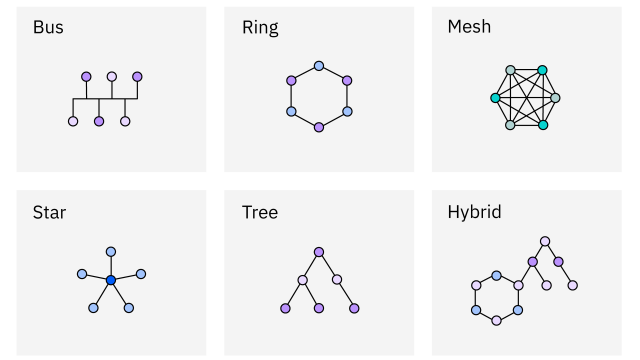

# 네트워크 일반

## 1. 네트워크 개요
- 정의: 여러 컴퓨터와 장비가 데이터를 주고받기 위해 연결된 구조
- 목적: 자원 공유, 정보 교환, 효율적 통신
- 구성요소: `단말장치`(PC, 프린터), `전송장치`(케이블, 스위치), `제어장치`(서버, 라우터).

## 2. 데이터통신 관련기술

### OSI 7계층
| 데이터 유니트 | 계층 | 주요 기능 | 장비 |
| - | - | - | - |
| data | 응용(application) | 사용자 인터페이스 제공 | - |
| data | 표현(presentation) | 암호화, 압축, 코드 변환 | - |
| data | 세션(session) | 세션 설정/유지/종료 | - |
| 세그먼트(segments) | 전송(transport) | 종단간 신뢰성 보장 | Gateway |
| 패킷(packets) | 네트워크(network) | 경로 설정, 라우팅 | Router |
| 프레임(frames) | 데이터 링크(data link) | 오류 제어, 흐름 제어 | Bridge, Switch |
| bit | 물리(physical) | 물리적 전송 | Repeater, Hub |

### TCP/IP 4계층
- 응용계층: OSI 5~7계층 통합
- 전송계층: TCP/UDP 프로토콜
- 네트워크계층: IP, ICMP, ARP
- 네트워크 인터페이스계층: OSI 1~2계층 통합

### 데이터 전송 절차
회선연결 → 링크설정 → 데이터 전송 → 링크해제 → 회선해제

### PCM 방식 (아날로그→디지털 변환)
아날로그 신호 → 표본화 → 압축 → 양자화 → 부호화 → 디지털 신호

## 3. 통신망
- 통신망 종류: LAN(근거리), MAN(도시권), WAN(광역)

### 네트워크 토폴로지: 버스, 스타, 링, 메시 구조

### 1)bus
- 하나의 중앙 통신회선에 여러 단말 연결
- 장점: 낮은 설치비용, 간단한 구조, 노드 추가 용이
- 단점: 장애 발생 시 전체 네트워크 영향, 병목 현상
### 2)성형/스타형 (Star)
- 중앙 노드에 모든 단말 연결 (Point-to-Point)
- 장점: 고속 네트워크 적합, 에러 탐지 용이, 노드 장애 시 네트워크 유지
- 단점: 중앙 노드 장애 시 전체 마비, 고가의 설치비용
- Fast Ethernet의 주요 토폴로지
### 3)링형 (Ring)
- 단말기들이 원형으로 연결
- 토큰 링 방식에 사용
### 4)계층형/트리형 (Tree)
- 트리 구조로 정보통신망 구성
- 장점: 네트워크 관리 용이, 확장 편리, 높은 신뢰도
- 단점: 특정 노드 트래픽 집중 시 속도 감소, 병목 현상
### 5) 메시형 (Mesh)
- 모든 노드가 다른 노드와 연결된 구조
- **특징**:
  - 노드 이동이 자유로워 토폴로지가 동적으로 변함
  - 다중 홉 라우팅(Multihop Routing) 방식
  - **중앙 제어나 표준 서비스 없이도 네트워크 구성 가능** ⭐
  - 하나의 연결이 끊어져도 자동으로 다른 경로로 메시지 전송
- 장점: 높은 신뢰성, 우회 경로 제공
- 단점: 복잡한 구조, 고비용

### 인터넷, 인트라넷, 엑스트라넷
- 인터넷: 전세계 TCP/IP 기반 공용 네트워크
- 인트라넷: 조직 내부 사설 네트워크 (TCP/IP 사용)
- 엑스트라넷: 인트라넷을 외부 파트너와 제한적 공유

## 4. 표준과 네트워크

### IEEE 802 위원회
- 1980년 2월 설립, LAN/MAN 표준화 조직

| 802.1	| 상위 계층 인터페이스, MAC 브리지	| LAN 간 네트워크 연결 |
| - | - | - |
| 802.2	| LLC (Logical Link Control)	| 논리 링크 제어, 오류 제어 |
| 802.3	| CSMA/CD, Ethernet	| 유선 LAN, 10Mbps |
| 802.4	| Token Bus	| 토큰 버스 방 |
| 802.5	| Token Ring	| 토큰 링 방식 |
| 802.6	| MAN	| 대도시 통신망 |
| 802.7	| Broadband LAN	| 광대역 LAN |
| 802.8	| Fiber Optic LAN	| 광섬유 LAN |
| 802.9	| Integrated Voice & Data	| 음성+데이터 통합 |
| 802.10	| Network Security	| 네트워크 보안 |
| 802.11	| CSMA/CA, Wireless LAN	| 무선 네트워크 |
| 802.12	| 100VG-AnyLAN	| 100Mbps LAN |

## 5. 네트워크설계, 구축
### Ethernet (IEEE 802.3)
- **CSMA/CD** 방식 사용(장치가 매체에 접속하는 것을 관리하는 방법)
- 버스 구조에서 사용
- 충돌 감지 및 재전송 메커니즘
- 적은 용량 데이터 전송 시 우수
- 설치비용 저렴, 관리 용이
- 부하 증가 시 충돌 증가로 지연 발생
### Fast Ethernet
- Star 토폴로지 사용
- 기존 Ethernet의 10배 향상 (100Mbps)
- 표준 Ethernet과 호환성 유지

## 6. 고속 LAN 기술 및 광대역통신
### FDDI (Fiber Distributed Data Interface)
- 광섬유를 이용한 고속 LAN
- 이중 링 구조
- 100Mbps 전송 속도
### ATM (Asynchronous Transfer Mode)
- 셀 단위 (53바이트) 전송
- 광대역 통신 기술
- 음성/데이터/영상 통합 전송
### 광대역 기술
- IEEE 802.7: Broadband LAN
- IEEE 802.8: Fiber Optic LAN

## 7. 각종 통신 기술
### CSMA/CD (Carrier Sense Multiple Access/Collision Detection)​
- 신호 전송 전 다른 신호 확인
- 전송 중 충돌 감시
- 충돌 발생 시 재전송 요구
- Ethernet에서 사용
### CSMA/CA (Carrier Sense Multiple Access/Collision Avoidance)​
- 무선 LAN에서 사용
- 충돌 회피 방식
### 토큰 방식
- Token Bus (IEEE 802.4)
- Token Ring (IEEE 802.5)
- 토큰 보유 시에만 데이터 전송
### 채널 부호화
- 원천 부호화된 정보에 에러 검출/정정 비트 추가
- `Convolutional Code: 채널 부호화 기술`
- ADPCM, ADM, PCM: 음성 부호화 기술 (채널 부호화 아님)

## 8. 기타
### 데이터 전송 방식
- 단방향(Simplex): TV, 라디오
- 반이중(Half Duplex): 무전기
- 전이중(Full Duplex): 전화기, Switch

### 프로토콜의 기본 기능
- **흐름 제어(Flow Control)**: 송신측과 수신측의 데이터 처리 속도 차이 조절
- **오류 제어(Error Control)**: 데이터 전송 중 발생한 오류 검출 및 정정
  - ACK(Acknowledgement) 미수신 시 재전송 수행
- **순서 제어(Sequence Control)**: 데이터 순서 보장
- **연결 제어(Connection Control)**: 연결 설정/유지/해제

### 컴퓨팅 아키텍처
- `포그 컴퓨팅(Fog Computing)`: 데이터 발생 지점 주변에서 선별적 분석/활용
- **그리드 컴퓨팅(Grid Computing)**: 분산된 자원을 하나로 묶어 사용
- **병렬 컴퓨팅(Parallel Computing)**: 여러 프로세서가 동시 작업
- **직렬 컴퓨팅(Serial Computing)**: 순차적 작업 처리

Multiplexing
Multiplexing 방법 중에서 다중화 시 전송할 데이터가 없더라도 타임 슬롯이 할당되어 대역폭의 낭비를 가져오는 다중화 방식은?(2025년 05월)(정답률:72%)
답: TDM

다음 (A) 안에 들어가는 용어 중 옳은 것은?(2024년 02월)(정답률:79%)
( A )란 단말이 네트워크에 접근하기 전 보안정책 준수여부를 검사하고 IP 및 MAC address의 인가 여부를 검사하며 네트워크 자원의 이용을 허용하 는 방식을 말한다. ( A ) 네트워크에 연결된 단말 의 여러 가지 정보를 수집하고, 수집된 정보를 바 탕으로 단말들을 분류하며. 분류한 그룹의 보안 위협 정도에 따라 제어를 수행한다.
NIC

