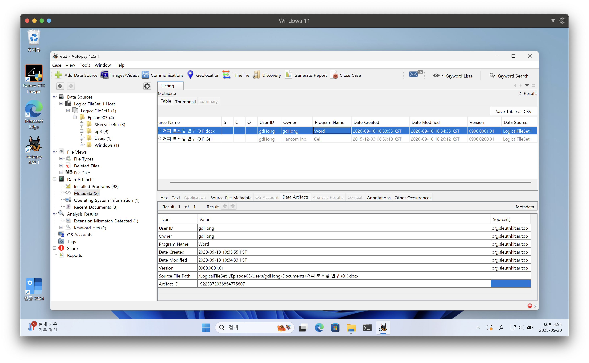
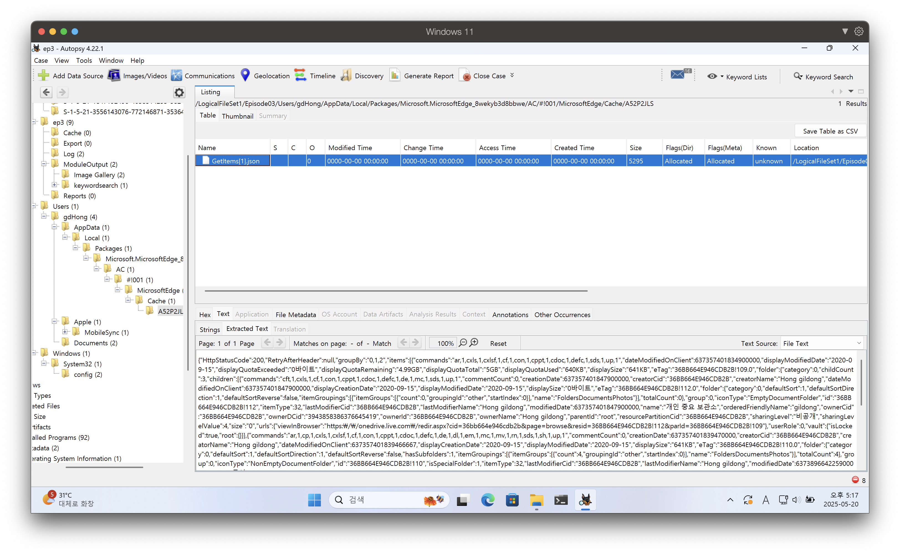
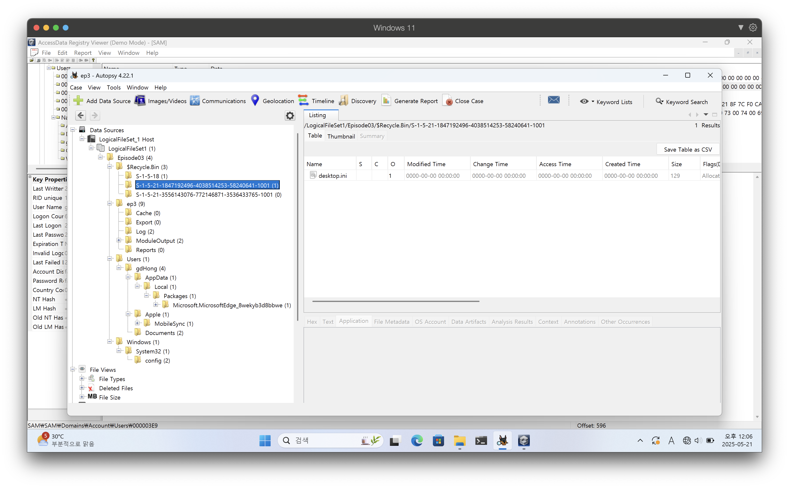
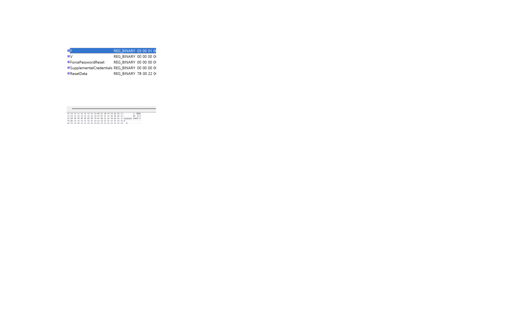

# 컴퓨터의 주된 사용자에 관한 분석

## ShellBag 정보분석
ShellBag이란? 사용자가 윈도우 탐색기에서 폴더를 열람할 때, 해당 폴더의 보기 설정, 크기, 위치, 마지막 접근 시간, 생성 시간 등의 정보가 윈도우 레지스트리에 자동으로 기록되는 아티팩트입니다. 삭제된 폴더나 외부 저장 장치에 연결되었던 폴더의 흔적도 남아있을 수 있어 디지털 포렌식에서 중요한 정보원으로 활용됩니다.

저장 위치: 주로 `NTUSER.DAT` (현재 사용자) 또는 `UsrClass.dat` 파일 내의 `Software\Microsoft\Windows\Shell\BagMRU` 및 `Software\Microsoft\Windows\ShellNoRoam\BagMRU` 레지스트리 키에 저장됩니다.

## 점프리스트(JumpList) 정보 분석
점프리스트란? 윈도우 7부터 도입된 기능으로, 시작 메뉴나 작업 표시줄에 고정된 애플리케이션 아이콘을 마우스 오른쪽 버튼으로 클릭했을 때 나타나는 최근 사용한 파일 또는 자주 사용하는 항목 목록을 말합니다. `AutomaticDestinations`와 `CustomDestinations` 두 가지 유형의 파일로 존재합니다.

저장 위치: `C:\Users\username\AppData\Roaming\Microsoft\Windows\Recent\AutomaticDestinations` 및 `CustomDestinations` 경로에 저장됩니다.

# 실습

## 문서파일 작성자 확인

## GetItem[1].json 파일에서 OneDrive 계정 사용자 분석

## SAM 파일 분석

### gdHong V값과 SID 비교

| S | SID의미|
| - | - |
| 1 | 버전 번호 |
| 5 | SID를 생성할 수 있는 최고수준의 권한등급 |
| 21-1847192496-4038514253-58240641 | 하위권한 |
| 1001 | 비교식별값 RID, 특정사용자 또는 그룹 식별 |

### F값에서 마지막 로그온 한 일시 확인

| 속성 | 값 | 변환 결과 |
| - | - | - |
| 마지막 로그온 시각 | Ox01D6A9C5350B5C5D | 2020.10.24. 05:19 (UTC) → 2020.10.24. 14:19 (KST) |
| 마지막 패스워드 변경 시각 | Ox01D68A52100CF1CC | 2020.09.14. 04:46 (UTC) → 2020.09.14. 13:46 (KST) |
| 마지막 실패 로그온 시각 | Ox01D6A6CE5823FA53 | 2020.10.20. 10:47 (UTC) → 2020.10.20. 19:47 (KST) |
| 로그온 횟수 | Ox45 | 69회 |

